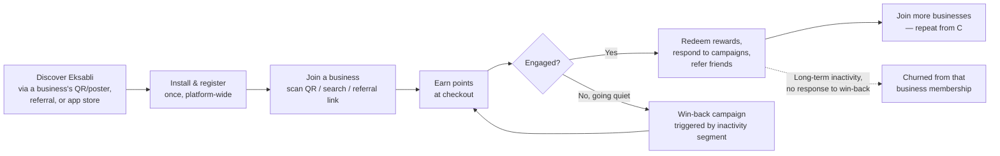
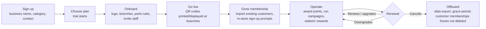

# 1. Business Strategy

[← Back to index](README.md)

## Contents
- [User & role model](#user--role-model)
- [SaaS model & multi-tenancy strategy](#saas-model--multi-tenancy-strategy)
- [Revenue model & pricing](#revenue-model--pricing)
- [Customer lifecycle](#customer-lifecycle)
- [Store lifecycle](#store-lifecycle)
- [20. MVP roadmap](#20-mvp-roadmap)
- [21. Risks](#21-risks)
- [22. Final recommendations](#22-final-recommendations)

## User & role model

Three distinct populations use Eksabli, and they map to two different identity realms (see
[System Architecture](02-system-architecture.md#two-identity-realms-the-key-decision)):

| Population | Realm | Roles | Scope |
|---|---|---|---|
| **Platform team** | Host | Super Admin, Support Agent, Billing/Finance Admin, Content Moderator | Global — sees all tenants |
| **Business staff** | Tenant | Business Owner, Branch Manager, Cashier/Redemption Staff, Marketing Manager | Scoped to one tenant (business) |
| **Customers** | Host (shared) | Customer, (future: Family Member — see [Future Features](07-loyalty-engine.md#future-features)) | Global identity, N independent business memberships |

### Platform roles (Host)

| Role | Responsibilities | Notes |
|---|---|---|
| Super Admin | Full platform control: tenants, plans, billing, categories, feature flags, support escalation | Should require MFA; every action audit-logged (ABP `AbpAuditLogs` already captures this) |
| Support Agent | View tenant/customer accounts (read-mostly), resolve tickets, issue goodwill point adjustments within a capped limit | Capped adjustment limit prevents a compromised support account from minting unlimited points |
| Billing/Finance Admin | Plans, invoices, payment reconciliation, refunds | Separate from Super Admin so billing changes are independently auditable |
| Content Moderator | Approve business profiles/logos, review flagged campaigns/offers | Only needed once the platform is open to self-serve signup (see [MVP Roadmap](#20-mvp-roadmap)) |

### Business roles (Tenant)

| Role | Responsibilities | Typical permission boundary |
|---|---|---|
| Business Owner | Everything within their tenant: branches, staff, point rules, campaigns, billing/plan, branding | `Eksabli.Business.*` (all) |
| Branch Manager | Manage one/more branches, view branch-level reports, manage branch staff | Scoped by `BranchId` in addition to `TenantId` |
| Cashier / Redemption Staff | Scan customer QR, award points at checkout, redeem coupons/rewards via PIN or QR | Deliberately narrow — no access to campaigns, reports, or billing |
| Marketing Manager | Create campaigns/offers, send notifications, view customer segments | No access to billing or staff management |

This maps directly onto ABP's permission system already scaffolded in this repo
(`EksabliPermissionDefinitionProvider` in `src/Eksabli.Application.Contracts/Permissions/`) —
each role above is a permission group, and staff accounts are ABP `IdentityUser`s scoped to their
tenant, exactly as ABP's Identity module already works out of the box.

### Customer role

Just **Customer** — deliberately flat. Loyalty apps that introduce customer-facing "roles" or
tiers as an *authorization* concept (rather than a *marketing* concept) tend to regret it; a
customer's **Tier** (Bronze/Silver/Gold, see [Loyalty Engine](07-loyalty-engine.md)) is business
data attached to a `Membership` row, not an identity role. Don't model it as one.

## SaaS model & multi-tenancy strategy

**Model:** multi-tenant SaaS, one shared application instance and (initially) one shared database,
each **Business = one ABP Tenant**. This is not a proposal — it's already the direction this repo is
built in (`AbpTenantManagementDomainModule`, `MultiTenancyConsts.IsEnabled` in
`EksabliDomainModule`). The strategic question is not *whether* to multi-tenant, but *how customers
relate to tenants*, which is answered in the [System Architecture doc](02-system-architecture.md#two-identity-realms-the-key-decision).

**Database isolation strategy — shared DB by default, escape hatch for large accounts:**

| Strategy | Description | When to use |
|---|---|---|
| **Shared database, shared schema, `TenantId` column** (recommended default) | All tenants in one Postgres database; ABP's `IMultiTenant` filter scopes every query automatically | MVP through the "1,000 stores" tier. Cheapest to operate, cheapest to migrate schema, and it's what ABP defaults to. |
| Database-per-tenant | Each tenant gets its own connection string (ABP supports this natively via `TenantConnectionStrings`, already a `DbSet` in `EksabliDbContext`) | Reserve for enterprise/regulated customers who contractually require data isolation, or a single very large tenant causing noisy-neighbor issues. Don't do this by default — it multiplies migration and ops cost for zero benefit to a typical SMB customer. |
| Hybrid | Shared DB for the long tail, dedicated DB for named large accounts | Realistic end state once you have a handful of enterprise logos. ABP supports this without a rearchitecture — it's a per-tenant connection string swap. |

**Why not database-per-tenant from day one** (a common instinct to "future-proof"): with a shared
identity of customers who join *many* tenants, database-per-tenant would force either (a) a
cross-database fan-out on every "my wallets" screen load, or (b) duplicating customer identity into
every tenant DB and reconciling it — both worse than the shared-schema default. This is a case where
the "safe-sounding" enterprise pattern is actually the wrong default for this specific business
model. Start shared, keep the door open (ABP gives you the door for free).

## Revenue model & pricing

Two forces pull pricing in different directions: businesses want predictable flat pricing;
Eksabli's own costs (SMS, push, storage, support) scale with how *active* a business's loyalty
program is, not with how big the business is on paper. Three models, compared:

| Model | How it works | Pros | Cons |
|---|---|---|---|
| Flat tiered SaaS | Starter/Growth/Enterprise, fixed monthly fee per tier | Predictable for customers; simple to sell | Misprices a 2-branch high-volume café vs a 20-branch dormant chain the same |
| Pure usage-based | Pay per active member, per point transaction, or per redemption | Costs track actual platform load; scales naturally with customer success | Unpredictable bills scare SMB buyers; harder to sell top-down |
| **Hybrid (recommended)** | Flat base fee per tier (covers a bundled quota of branches/active members/campaigns) + metered overage (extra active members, SMS credits, premium features) | Predictable floor, usage-aligned ceiling; matches how comparable loyalty SaaS products (Smile.io, LoyaltyLion-style) price in practice | Slightly more complex billing logic — mitigated by ABP's Feature Management module already handling "quota" as a first-class concept |

**Suggested tiers** (illustrative — validate against target market before publishing):

| Tier | Target | Branches | Active members/mo | Campaigns | Notifications | Price shape |
|---|---|---|---|---|---|---|
| Starter | Single-location shop | 1 | up to 500 | 1 active | In-app + email only | Low flat fee, or free with Eksabli branding on customer-facing pages |
| Growth | Small chain | up to 5 | up to 5,000 | Unlimited | + Push, limited SMS credits | Mid flat fee + per-extra-branch add-on |
| Scale | Regional chain | up to 25 | up to 50,000 | Unlimited + segmentation | + SMS at cost, API access | Higher flat fee + metered overage |
| Enterprise | National chain / franchise | Unlimited | Custom | Custom, white-label | Dedicated sender IDs, custom domain | Custom contract, optional dedicated DB |

Every row in the "what's included" table above is a natural **ABP Feature** definition
(`FeatureDefinitionProvider`, already the documented pattern in this repo's `.cursor/rules`) —
plan enforcement is a feature-check, not new business logic: `RequiresFeature("Eksabli.SMSNotifications")`,
`GetAsync<int>("Eksabli.MaxBranches")`, etc. This is a concrete case of "the framework already
does this" — don't build a custom entitlements engine.

**Free trial vs freemium:** recommend a time-boxed free trial (14–30 days, full Growth-tier features)
over a permanent free tier. A permanent free tier for a *loyalty* product is risky: it invites
low-intent signups that still consume support and infra (notification volume, storage), without the
urgency a trial creates to convert. Revisit once there's data on activation rates.

## Customer lifecycle



Key point: **churn is per-membership, not per-account.** A customer can go inactive at Nike while
still active at Starbucks. Retention reporting (see [Reports & Analytics](06-dashboards-admin.md#reports--analytics))
must be scoped per business, and win-back campaigns are a tenant-level campaign type, not a
platform-level one.

## Store lifecycle



**Offboarding detail worth deciding now, not later:** when a business cancels, its customers'
`Membership`/`PointsWallet` rows should **freeze, not delete** — the customer's global account and
their history at *other* businesses must be unaffected (this falls directly out of the two-realm
identity decision). Define a data-retention window (e.g., 90 days frozen, then archived) up front —
it's a GDPR-relevant decision (see [Security](02-system-architecture.md#security)) and much cheaper
to design in now than to retrofit after a business's first cancellation support ticket.

---

## 20. MVP roadmap

Philosophy: **prove the core loop (join → earn → redeem) end-to-end for a handful of real
businesses before building anything adjacent to it.** Gamification, campaigns, and analytics are
retention/growth features for a platform that already has the core loop working — building them
first is a classic "solving problems you don't have yet" trap.

```mermaid
gantt
    title Eksabli MVP Roadmap (illustrative durations)
    dateFormat  X
    axisFormat %s
    section Phase 1 — Core Loop
    Identity (two realms), Tenant onboarding      :p1a, 0, 3w
    Branches, Points wallet, manual point award   :p1b, after p1a, 3w
    Flutter app: register, join, wallet, QR       :p1c, after p1a, 4w
    Business dashboard: branches, staff, customers:p1d, after p1a, 4w
    section Phase 2 — Redemption & Money
    Rewards + QR/PIN redemption                   :p2a, after p1c, 3w
    Subscription plans + billing (Stripe et al.)  :p2b, after p1d, 4w
    Point rules engine (per $, per visit)         :p2c, after p2a, 2w
    section Phase 3 — Retention Engine
    Campaigns (birthday, double points, win-back) :p3a, after p2c, 4w
    Push/Email/SMS notification service           :p3b, after p2c, 3w
    Referral program                              :p3c, after p3a, 2w
    section Phase 4 — Scale & Polish
    Reports/analytics dashboards                  :p4a, after p3b, 3w
    Admin panel (platform ops, support tools)      :p4b, after p2b, 3w
    Tiers/levels, gamification                    :p4c, after p3c, 3w
    Public web app / discovery                    :p4d, after p4a, 3w
```

| Phase | Goal | Ships |
|---|---|---|
| **Phase 1 — Core Loop** | A business can onboard and a customer can join and earn points | Two-realm identity & auth (OpenIddict), Tenant/Branch CRUD, `Membership` + `PointsWallet`, manual/staff-initiated point award, Flutter: register/login, join business via QR, view wallet; Angular dashboard: branch & staff management, customer list |
| **Phase 2 — Redemption & Money** | The loop closes (points become value) and the business pays | Rewards catalog, QR/PIN redemption flow (token-gated, mirroring the download-token pattern already in this repo), configurable point-earning rules, subscription plans wired to ABP Feature Management, payment provider integration, invoicing |
| **Phase 3 — Retention Engine** | The platform starts producing value beyond a manual punch-card | Campaign engine (birthday, double points, spend-X-get-Y, inactivity win-back), unified notification service (push/email/SMS), referral program |
| **Phase 4 — Scale & Polish** | Ready for a real launch and for the businesses that succeed on it | Reports/analytics, platform admin panel (support tooling, tenant management, feature flags), tiers/levels/badges, public discovery web app |

**What's explicitly deferred past Phase 4** (see [Future Features](07-loyalty-engine.md#future-features)
for the full list and rationale): AI recommendations/churn prediction, Apple/Google Wallet passes,
NFC/beacon check-in, in-app chat, marketplace, point transfer between customers, family accounts.
None of these are needed to prove the business model; all of them are meaningfully easier to build
well once there's real usage data to design against.

## 21. Risks

| Risk | Category | Likelihood/Impact | Mitigation |
|---|---|---|---|
| Two-realm identity model is mis-implemented (customers accidentally tenant-scoped) | Technical | Med / High — breaks the core value prop ("join unlimited businesses") | Treat the identity realm split as a Phase-1 architecture spike with a written spec and a test that proves one customer account holds independent balances at 2+ tenants before any other feature is built on top |
| Point fraud (offline point minting, replayed QR/PIN codes, staff self-redemption abuse) | Security | Med / High — direct financial/trust damage | Server-authoritative point mutations only, short-lived single-use redemption tokens (pattern already in this codebase), staff redemption audit trail, per-staff daily award caps |
| Underpriced usage-heavy tenants (a "free" high-SMS-volume business costs more than it pays) | Business | Med / Med | Metered overage on notifications from day one, even if the base fee is flat; alert on anomalous usage per tenant |
| Multi-tenant noisy neighbor (one large tenant's campaign fan-out slows the platform for everyone) | Scaling | Low early / High at scale | Background jobs queued and rate-limited per tenant, not just globally; see [Scalability](02-system-architecture.md#scalability) |
| GDPR / data-residency requirements from an enterprise or EU customer | Legal | Low early / High if it happens | Design deletion/export as a first-class capability early (per-customer and per-tenant), even if not exposed in UI until needed |
| Build-vs-buy overreach: reinventing billing, notifications, or search instead of integrating | Technical/Business | Med / Med | Default to buying (Stripe/Paddle for billing, FCM/OneSignal for push, a transactional email/SMS provider) — see [Backend Technology](02-system-architecture.md#backend-technology) |
| "100 million customers" scale planning consumes Phase 1 engineering time | Business | Med / Med — classic premature scaling | Explicitly sequence scalability work by tier (see [Scalability](02-system-architecture.md#scalability)); nothing in Phase 1–2 should be justified by "but what about 100M users" |
| Consumer identity realm (Host) becomes a hot spot once customer count is large | Scaling | Low early / Med-High later | Documented as a known future extraction point (see [System Architecture](02-system-architecture.md#two-identity-realms-the-key-decision)); not a Phase 1–3 concern |
| Category/business-name collisions and low-quality tenant signups if self-serve signup ships before moderation | Product/Trust | Med / Med | Manual approval queue for new tenants until Content Moderator tooling exists (Phase 4); don't auto-publish new businesses to customer search pre-moderation |

## 22. Final recommendations

Speaking as the person who has to own this in production:

1. **The two-realm identity decision is the whole ballgame — settle it in week one, in writing, with
   a passing integration test, before any UI is built.** Every other document in this set assumes
   it's settled correctly. Getting it wrong doesn't fail loudly; it fails as a slow accumulation of
   workarounds (e.g., someone "temporarily" scoping a customer to their first-joined tenant to make a
   query easier) that becomes very expensive to unwind once real customer data exists.

2. **Don't build three frontends when you need two.** The brief lists Flutter app, Web Application,
   SaaS Admin Portal, and (implicitly) a platform Admin Panel — that reads as four surfaces. Recommend
   collapsing platform-admin into the *same* Angular app as the business dashboard (Host vs Tenant
   views, gated by ABP's existing permission system — this is the standard ABP SaaS pattern, not a
   novel idea), and treating the customer-facing "Web Application" as a secondary, lighter surface
   (public discovery + a lightweight wallet view) rather than a full parity client — the mobile app is
   the primary customer surface. That's 2.5 frontends to build and maintain, not 4. See
   [System Architecture](02-system-architecture.md) for the concrete layout.

3. **Resist database-per-tenant and microservices until a specific, named pain forces them.** Both
   are reversible-later decisions if you keep module boundaries clean (which ABP's project structure
   already forces you to do); they are expensive-now decisions if adopted speculatively. The
   "100,000 stores" scale in the brief is a useful stress test for the *design* (make sure nothing is
   architecturally precluded), not a build target for Phase 1.

4. **Reuse ABP's SaaS-shaped modules aggressively.** Feature Management → plan entitlements. Tenant
   Management → business accounts. Permission Management → the whole role table above. Background
   Jobs → campaign scheduling and point expiry sweeps. Audit Logging → the security section's audit
   requirement. Blob Storage → logos/images. This isn't "using a framework for its own sake" — each
   of these is a multi-week feature in a from-scratch build that's a config file here.

5. **Challenge the "unlimited businesses, unlimited scale" framing where it would gold-plate the
   MVP.** Family accounts, point transfer, NFC/beacon, marketplace, and AI churn prediction are all
   reasonable *eventually* — none of them are required to validate whether a business will pay for
   this and whether a customer will use it. Cutting them from Phase 1–4 is not a compromise, it's
   the point of having phases.

6. **Money and fraud-adjacent flows (redemption, point awarding, billing) deserve disproportionate
   engineering care relative to their "screen count."** They're a small fraction of the UI surface
   and the majority of the trust and legal exposure. Budget accordingly rather than by screen count.
