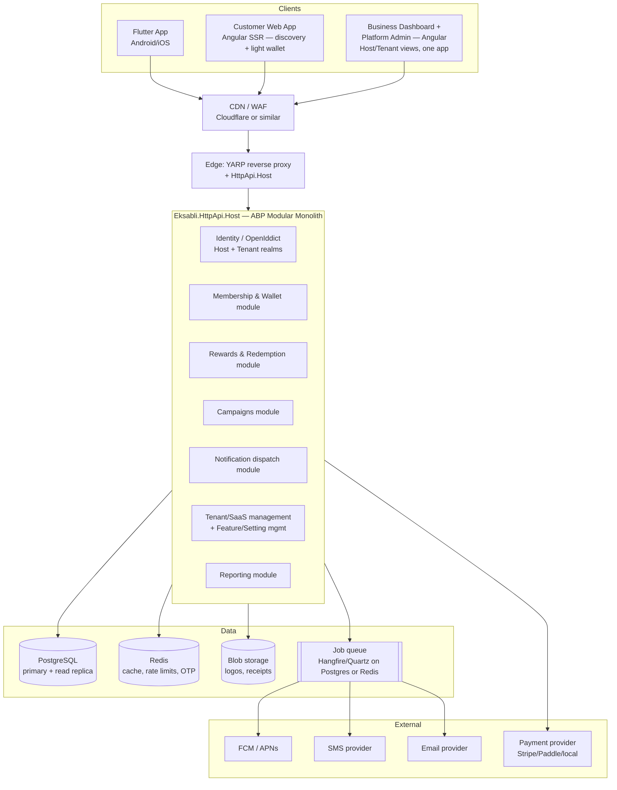
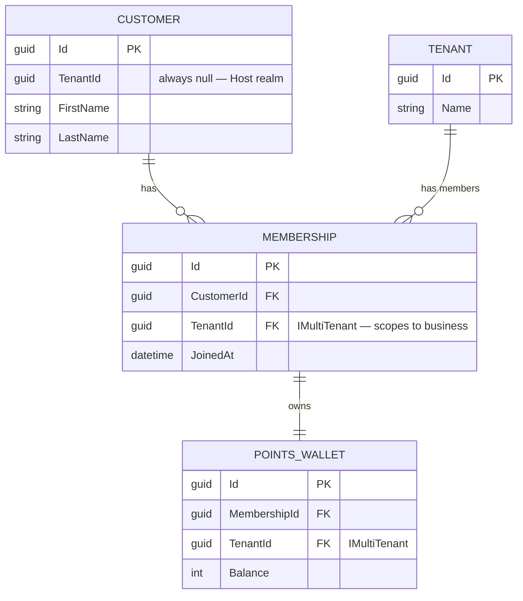
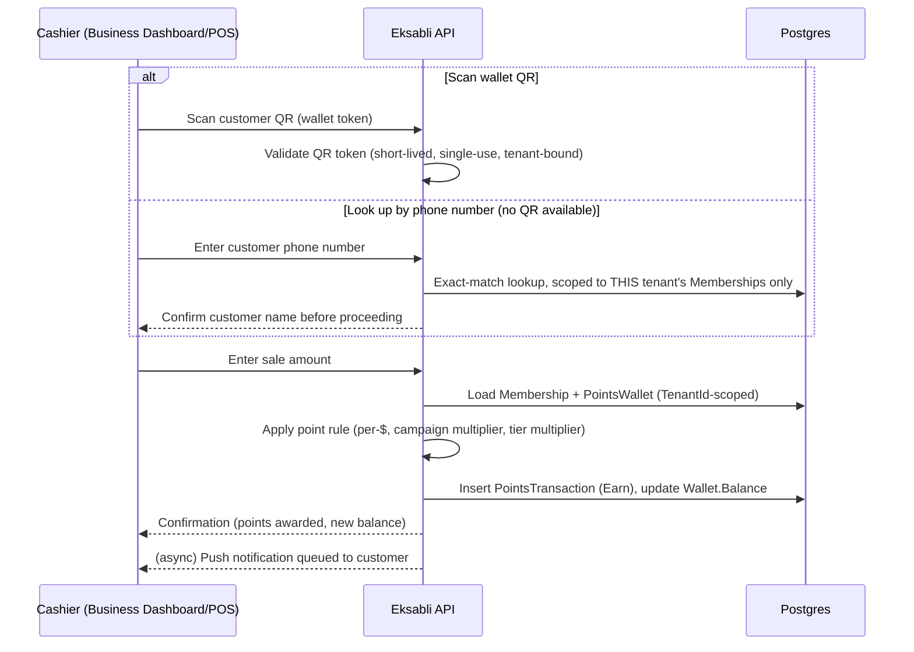
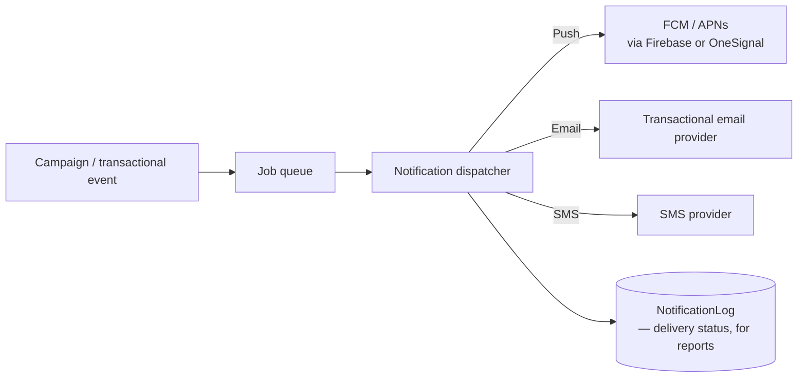

# 2. System Architecture

[← Back to index](README.md)

## Contents
- [Architecture pattern: modular monolith](#architecture-pattern-modular-monolith)
- [High-level architecture](#high-level-architecture)
- [Two identity realms (the key decision)](#two-identity-realms-the-key-decision)
- [Backend technology](#backend-technology)
- [API gateway / edge](#api-gateway--edge)
- [Background jobs](#background-jobs)
- [Notification service](#notification-service)
- [Security](#security)
- [14. API design](#14-api-design)
- [Scalability](#scalability)

## Architecture pattern: modular monolith

| Option | Description | Verdict |
|---|---|---|
| Single unstructured monolith | One project, no internal boundaries | ❌ — makes future extraction painful, and ABP doesn't build this way anyway |
| **Modular monolith (recommended)** | One deployable, strict module boundaries enforced at the project-reference level (already how this repo is structured: `Domain` → `Application` → `HttpApi` → `Host`, one module per bounded context) | ✅ for MVP through the "10,000 stores" tier |
| Microservices from day one | Separate deployables per bounded context (Identity, Wallet, Campaigns, Notifications...) with network calls between them | ❌ for now — see below |

**Why not microservices now:** microservices trade development simplicity for independent
scalability and deployability. At MVP scale, Eksabli has neither multiple teams needing independent
release cadences nor a proven hot-spot that needs independent scaling — so the trade buys nothing
and costs a lot (distributed transactions for "award points → update campaign progress → send
notification," network-call debugging, N deployment pipelines, N sets of observability). The brief's
own "100 million customers" framing is exactly the scenario that tempts premature microservices
adoption; see [Scalability](#scalability) for why that's a later-tier decision, not a Phase-1 one.

**Why "modular" still matters even though it's one deployable:** ABP's project structure already
forces this discipline (a `Campaigns` domain module cannot silently reach into `Wallet`'s DbContext;
it goes through a repository or an event). That module discipline is what makes **future extraction
cheap if a specific module ever needs to scale independently** — most likely candidates, in order:
Notifications (bursty, queue-shaped workload) and Points/Wallet (highest write volume). Design new
domain modules (`Eksabli.Membership`, `Eksabli.Rewards`, `Eksabli.Campaigns`, `Eksabli.Notifications`)
as ABP modules with their own `Domain`/`Application` folders from the start, even inside the single
deployable — it costs nothing today and is the entire reason extraction later is a refactor, not a
rewrite.

## High-level architecture



This is a direct evolution of what's already in `src/`: `Eksabli.HttpApi.Host` is the edge process,
`Eksabli.Domain`/`Eksabli.Application` gain new bounded-context folders (`Membership/`, `Rewards/`,
`Campaigns/`, `Notifications/`) alongside the existing `Authors/`/`Books/` (which get deleted once
the real domain lands), and `Eksabli.EntityFrameworkCore` gains the corresponding `DbSet`s and
`OnModelCreating` configuration in `EksabliDbContext` — the same file already doing this for
Identity and Tenant Management today.

## Two identity realms (the key decision)

Restating the tension from the [index](README.md#the-one-decision-everything-else-depends-on):
customers are global, businesses are tenants, and a customer's relationship to N businesses must be
independent per business while the customer account itself is singular.

**Recommended model: reuse ABP's existing Host/Tenant split as the Consumer/Business split.**

| | Host realm | Tenant realm |
|---|---|---|
| Who | Customers + platform admins | Business owners + staff |
| `TenantId` on `IdentityUser` | `null` | Business's tenant ID |
| Token endpoint | Same OpenIddict server, `realm=consumer` claim mapped to Host context | Same OpenIddict server, tenant resolved from subdomain/header/claim as ABP does by default |
| What it unlocks | One login, works across every business, matches "install once" requirement | Full ABP multi-tenancy: automatic `IMultiTenant` query filtering, tenant-scoped settings/features/branding, tenant admin can't see other tenants' data by construction |

**Why this specific mapping (Host = consumers) rather than inventing a third identity store:**
ABP already ships a Host/Tenant distinction (`AbpTenantManagementDomainModule`, already a dependency
in `EksabliDomainModule`) and `EksabliDbContext` already merges Identity + Tenant Management into one
`DbContext`/database. Host users are, by ABP's own design, the identities that aren't scoped to any
tenant — which is precisely what a customer needs to be. This avoids standing up a third identity
provider or duplicating user records per business.

**The honest trade-off:** ABP's Host realm is *designed* for a small number of trusted platform
operators, not potentially millions of end consumers. Using it this way is unconventional and
should be validated early (connection pool behavior, `AbpUsers` table growth, whether ABP's
Host-side tooling assumes "few users"). It's the right MVP-through-mid-scale choice; the
[Scalability](#scalability) section names the point at which it's worth extracting consumer identity
into a dedicated service.

**How the data model expresses this** (detailed in [Database Design](03-database-design.md)):



`Membership` and `PointsWallet` implement `IMultiTenant`. Two query shapes fall out of this cleanly,
both using ABP APIs already documented in this repo's `.cursor/rules/framework/common/multi-tenancy.mdc`:

- **Business dashboard** ("show me my customers"): runs as a tenant user, `CurrentTenant.Id` is set,
  ABP's automatic filter means a plain `_membershipRepository.GetListAsync()` is *already* scoped to
  that business. No manual `WHERE TenantId = ...` anywhere in application code.
- **Customer wallet screen** ("show me all my balances"): runs as a Host user with no current tenant,
  so the filter is explicitly disabled and replaced with a `CustomerId` filter:
  ```csharp
  using (DataFilter.Disable<IMultiTenant>())
  {
      var wallets = await _walletRepository.GetListAsync(w => w.Membership.CustomerId == CurrentUser.Id);
  }
  ```

**Sequence — customer earns points at checkout** (staff-initiated, server-authoritative — see
[Security](#security) for why this must never be a client-trusted operation):



**Why phone lookup needs its own scoping rule, not just a UI fallback:** phone numbers live on the
*Host-realm* `IdentityUser` ([two identity realms](#two-identity-realms-the-key-decision)), not on
the per-tenant `Membership`. A naive "search customers by phone" endpoint would therefore be tempted
to query the global Host-realm user directory directly — which would leak cross-tenant information
(at minimum, "is this phone number an Eksabli user at all") to tenant-side staff who should only ever
see their own business's members. The correct shape is the opposite of a search: a **single
exact-match lookup**, scoped from the start to "does a `Membership` with `TenantId = <this business>`
exist whose `Customer.PhoneNumber` equals exactly this value" — no partial/fuzzy matching, no
autocomplete-as-you-type, and every lookup audit-logged (same audit mechanism as
[manual point adjustments](07-loyalty-engine.md#8-points-system)). This keeps the fallback genuinely
equivalent to scanning a QR — "identify one specific, already-known customer" — rather than quietly
becoming a customer-directory search feature.

## Backend technology

| Option | Pros | Cons | Fit for Eksabli |
|---|---|---|---|
| **.NET / ABP Framework (recommended — already in repo)** | Identity, multi-tenancy, permissions, feature management, background jobs, audit logging, OpenIddict, and Mapperly-based mapping all already wired and in active use in this exact repo; strong typing; mature EF Core/Postgres support | Smaller open-source hiring pool than Node in some markets; ABP has a learning curve if the team is new to it | **Best fit.** The comparison isn't "greenfield .NET vs greenfield Node" — it's "keep 80% of the SaaS scaffolding this repo already has vs throw it away." Nothing about the loyalty domain favors another stack strongly enough to justify that. |
| Node.js / NestJS | Huge ecosystem, easy to hire for, good for I/O-heavy notification fan-out | Multi-tenancy, permissions, feature-flagging, audit logging all need to be built or assembled from third-party packages — none of it exists yet in this repo | Reasonable if starting from zero; not reasonable given the current starting point |
| Go (custom or with a framework) | Excellent performance/concurrency for the notification/queue-heavy paths | No DDD/multi-tenancy scaffolding at all; slower to build the CRUD-heavy business/admin surfaces that make up most of the platform | Worth revisiting *only* as an extraction target for a specific hot module (e.g., a future standalone notification-fanout service), not as the primary backend |
| Django / Python | Fast CRUD scaffolding, good admin tooling out of the box | Multi-tenancy and fine-grained feature-gating are DIY; weaker fit for the "many independent modules in one deployable" modular-monolith goal | Not recommended |

**Recommendation: stay on .NET/ABP.** Delete the `Author`/`Book` tutorial scaffolding, keep the
project structure, framework, and database.

## API gateway / edge

At MVP scale, a dedicated API gateway product (Kong, Ambassador, Apigee) is more operational surface
than value. Recommended edge stack:

1. **CDN/WAF** (Cloudflare or equivalent) — TLS termination, DDoS protection, static asset/image
   caching for logos and public store pages.
2. **YARP** (.NET-native reverse proxy) or simply exposing `Eksabli.HttpApi.Host` directly behind the
   CDN — handles routing, rate limiting, and (later) request shaping if/when specific modules are
   extracted to separate services. YARP is the natural choice here because it's .NET, so it shares
   observability and deployment tooling with the rest of the stack rather than adding a second
   runtime to operate.
3. Promote to a full gateway product only when there are genuinely multiple backend deployables to
   route between (i.e., after a real microservice extraction, not before).

## Background jobs

ABP's background job abstraction is already a dependency in this repo (`AbpBackgroundJobsDomainModule`
in `EksabliDomainModule`). Recommended jobs:

| Job | Trigger | Notes |
|---|---|---|
| Point expiration sweep | Scheduled (daily) | Expires `PointsTransaction`s past their `ExpiresAt`, per tenant's expiration policy |
| Birthday campaign trigger | Scheduled (daily) | Scans for memberships with a birthday in N days, enqueues campaign sends |
| Inactivity / win-back trigger | Scheduled (daily/weekly) | Segments customers by last-activity date per tenant, enqueues win-back campaigns |
| Campaign notification fan-out | Enqueued on campaign activation | Highest-volume job — must be rate-limited **per tenant**, not just globally, so one business's campaign can't starve another's notifications (see [Risks](01-business-strategy.md#21-risks)) |
| Subscription renewal / invoice generation | Scheduled | Ties into billing provider webhook confirmation |
| Excel/report export | Enqueued on user request | Same token-gated download pattern already implemented for `BookAppService`/`AuthorAppService` in this repo — reuse it for customer-list and transaction-history exports |

**Provider choice:** ABP's default in-process job executor is fine for Phase 1–2. Move to
**Hangfire** (Postgres or Redis storage) once campaign fan-out volume matters — it gives retry,
scheduling, and a dashboard without leaving the .NET ecosystem, and ABP's background job abstraction
supports swapping providers without changing calling code.

## Notification service

A single internal abstraction (`INotificationSender`) behind three channel adapters, all invoked
through the background job queue so a slow SMS provider never blocks a request thread:



Buy, don't build, the channel providers themselves (Firebase Cloud Messaging or OneSignal for push;
a transactional email provider; a regional SMS aggregator relevant to the target market). The
in-house work is the dispatcher, per-tenant rate limiting/quota enforcement (tied to the plan's
Feature Management quota), and the `NotificationLog` table that reporting reads from.

## Security

| Concern | Approach |
|---|---|
| Authentication | OpenIddict (already in this repo), Authorization Code + PKCE for the Flutter app and web clients — **not** Resource Owner Password Credentials, which is deprecated and unsuitable for public mobile clients |
| OTP login | Custom OpenIddict grant type (ABP supports extending OpenIddict's grant handlers) backed by a short-lived, single-use code cached in Redis — same "cache-backed short-lived token" shape already used for Excel download tokens in this repo |
| Access/refresh tokens | Short-lived access tokens (15–60 min), rotating refresh tokens, refresh tokens bound to a `Device` record so a stolen refresh token can be revoked per-device without logging out every device |
| Authorization | ABP permission system end to end (already the documented pattern in `.cursor/rules`) — no hand-rolled role checks |
| Encryption | TLS everywhere (enforced at the CDN/edge); ABP's `isEncrypted` setting flag for secrets at rest (e.g., API keys stored as tenant settings); payment data never touches Eksabli's own database — tokenized via the payment provider |
| GDPR / data rights | Per-customer export and delete must be first-class from Phase 1, even if not exposed in UI until required — see the [store offboarding note](01-business-strategy.md#store-lifecycle) for why "delete" actually means "freeze then archive" for `Membership` data tied to a still-active business |
| Audit logs | ABP's `AbpAuditLogging` module is already a dependency — covers who-did-what for staff/admin actions automatically; extend with explicit domain events for point adjustments and redemptions specifically, since those need business-readable audit trails, not just HTTP-call logs |
| Rate limiting | Per-IP at the edge (CDN/YARP) for auth endpoints (brute-force/OTP-spam protection); per-tenant at the application layer for notification-triggering actions |
| Device management | `Device` table (push token, platform, last-seen) per customer; supports "log out this device," which OTP-based consumer apps need for support/trust reasons |

## 14. API design

REST, resource-grouped, generated via ABP's Auto API Controllers (already the pattern for
`BookAppService`/`AuthorAppService` in this repo — an `IApplicationService` interface becomes a
controller automatically, no hand-written routing).

| Group | Example resources | Realm |
|---|---|---|
| `/api/identity/*` | registration, login, OTP request/verify, token refresh, profile | Host (customers) + Tenant (staff), same shape |
| `/api/businesses/*` | business search/discovery, business profile, branches | Public read (discovery) + Tenant-authenticated write |
| `/api/memberships/*` | join business, my memberships, my wallets | Host (customer-scoped) |
| `/api/wallet/{tenantId}/transactions` | points history for one business | Host, filtered by `CustomerId` |
| `/api/pos/award-points` | staff-initiated point award (QR/manual) | Tenant (cashier+) |
| `/api/rewards/*` | reward catalog, redeem, redemption status | Mixed — catalog is customer-read, redemption is staff-confirmed |
| `/api/campaigns/*` | CRUD, activate, target-segment preview | Tenant (marketing+) |
| `/api/notifications/*` | send, delivery log, customer preferences | Tenant (send) + Host (preferences) |
| `/api/admin/tenants/*`, `/api/admin/subscriptions/*`, `/api/admin/support-tickets/*` | platform administration | Host, Super Admin/Support/Billing only |
| `/api/reports/*` | dashboards, exports | Tenant (business reports) + Host (platform reports) |

Versioning: URL-segment versioning (`/api/v1/...`) from the start — cheap to add now, expensive to
retrofit once the Flutter app is in app-store review cycles that lag behind backend deploys.

## Scalability

Sequenced by tier, matching the [MVP roadmap](01-business-strategy.md#20-mvp-roadmap)'s "prove the
loop first" philosophy — each tier lists **only what changes**, not a rebuild:

| Tier | What's different from the tier before | Concrete changes |
|---|---|---|
| **~100 stores** (MVP/launch) | Baseline | Single Postgres primary, modular monolith single deployment, Redis for cache/OTP/rate-limits, in-process or basic Hangfire background jobs, single region |
| **~1,000 stores** | Read load and background-job volume grow faster than write load | Add a Postgres read replica for reporting queries; move background jobs to dedicated worker process(es) separate from the web process; CDN caching for store/logo images; connection pooling (PgBouncer) |
| **~10,000 stores** | `PointsTransaction` becomes a genuinely huge, hot table; a few bounded contexts start to have distinct load shapes | Table partitioning on `PointsTransaction` (by time or tenant hash); extract Notifications as its own worker fleet (queue-shaped workload, easy to isolate first since it's already a clean module boundary); consider extracting the Points/Wallet write path if it's the write bottleneck — this is the payoff of having kept module boundaries clean from day one |
| **~100M customers (platform-wide)** | Reporting/analytics queries compete with transactional load; a single relational primary is no longer the right tool for everything | Separate OLAP read model for reporting/analytics (e.g., a columnar warehouse fed by CDC from Postgres) rather than reporting off the transactional DB; dedicated search index (Elasticsearch/Meilisearch/Postgres+PostGIS) for "nearby stores" and discovery; evaluate extracting the Host-realm consumer identity store if it's become the bottleneck (flagged as a known risk in [Two identity realms](#two-identity-realms-the-key-decision)); multi-region likely if the customer base is geographically spread |

**Caching:** Redis for hot reads (wallet balance on the wallet screen, OTP codes, session data) and
for rate-limit counters. CDN for all static/semi-static assets (logos, reward images, public store
pages).

**Geo queries** ("nearby stores"): Postgres + **PostGIS** is the pragmatic default given Postgres is
already the database — avoids standing up a separate geo-search service until "nearby stores" search
volume genuinely needs it (see the 10,000-store tier).

**The meta-point:** nothing above requires deciding today that Eksabli will be a microservices,
multi-region, event-sourced platform. It requires deciding today that module boundaries stay clean —
which ABP's project structure already enforces — so that each tier's change is additive
infrastructure, not a rewrite.
