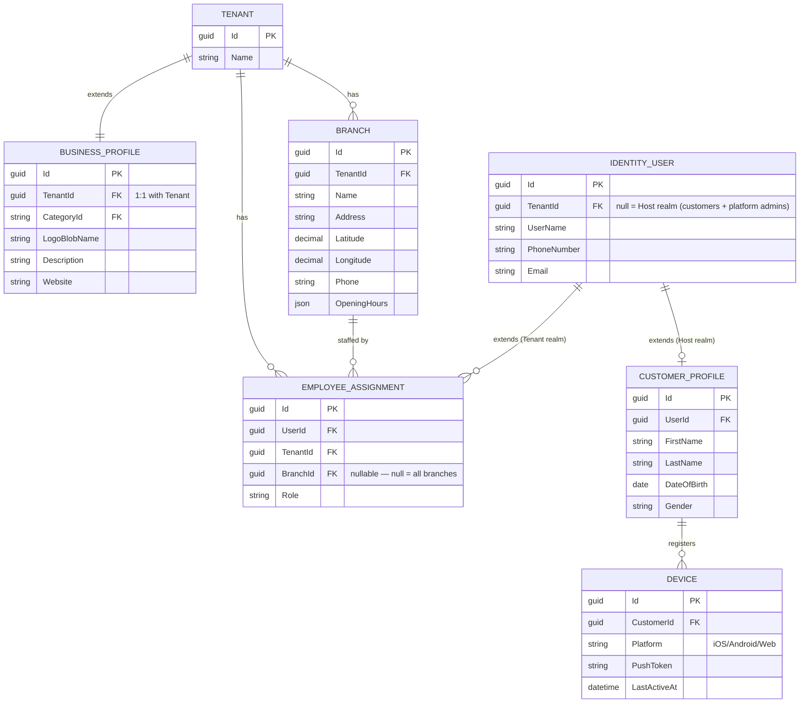
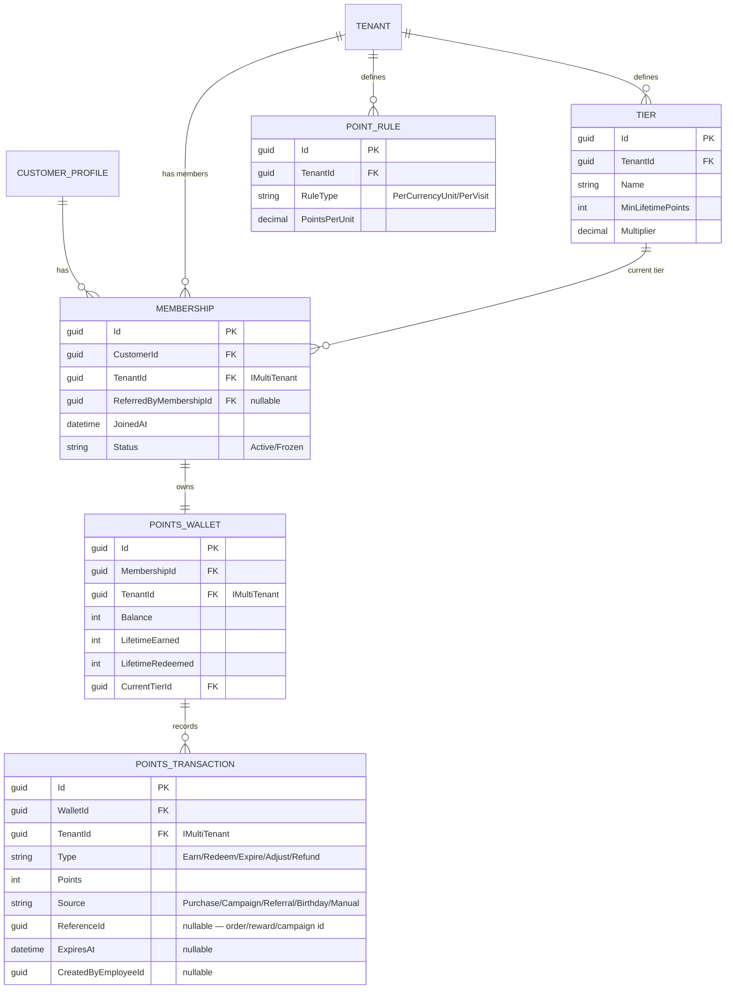
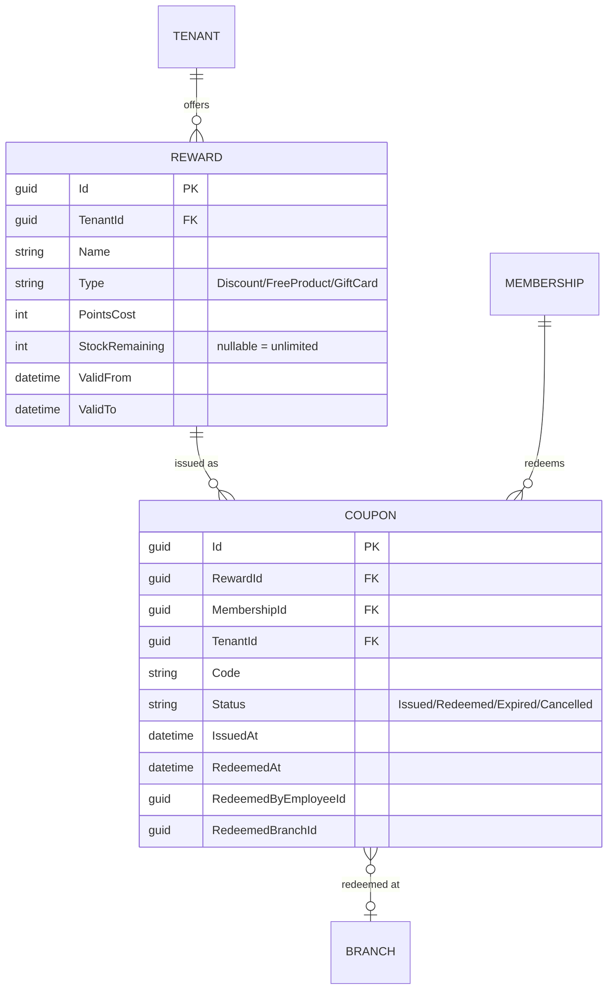
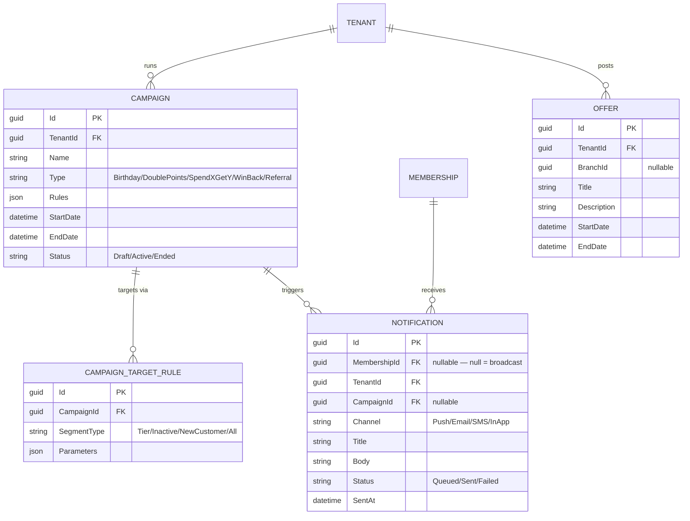
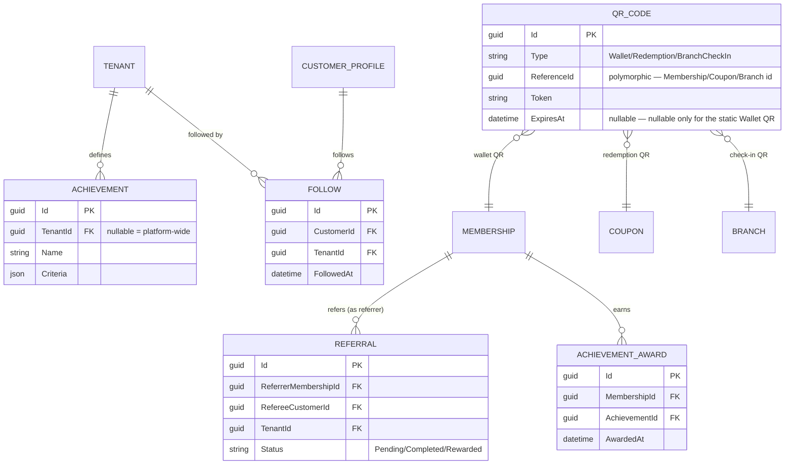
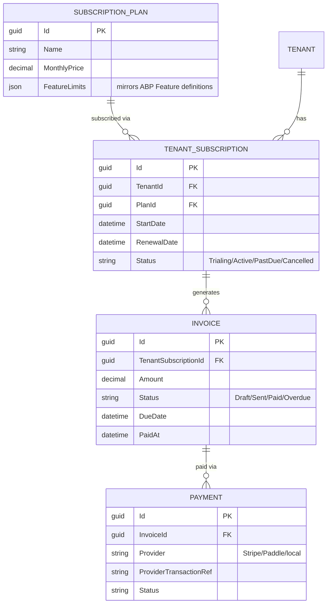

# 3. Database Design

[← Back to index](README.md)

Single PostgreSQL database (matches `EksabliDbContext`'s existing `[ConnectionStringName("Default")]` +
`UseNpgsql()` setup), shared schema, `TenantId`-scoped per the [multi-tenancy strategy](01-business-strategy.md#saas-model--multi-tenancy-strategy).
Table prefix `App` (existing `EksabliConsts.DbTablePrefix`) is retained for new tables for consistency.

**Read this first:** a meaningful chunk of the brief's requested tables (`Users`, `Sessions`,
`Audit Logs`, `Subscriptions`-adjacent settings, feature flags) **already exist** via ABP modules this
repo already depends on. They're listed below with a ✅ so the "what's actually new" scope is clear —
building them again would be pure waste.

| Requested table | Status |
|---|---|
| Users | ✅ ABP Identity (`IdentityUser`) — already `EksabliDbContext.Users` |
| Sessions | ✅ ABP Identity (`IdentitySession`) — already `EksabliDbContext.Sessions` (ABP 10.x) |
| Audit Logs | ✅ `Volo.Abp.AuditLogging` — already a dependency in `EksabliDomainModule` |
| Businesses | ✅ ABP `Tenant` (Tenant Management module), **extended** with a new `BusinessProfile` table for loyalty-specific fields |
| Devices, Membership, Points Wallet, Transactions, Rewards, Coupons, Campaigns, Offers, Notifications, Referral, Levels/Tiers, Achievements, QR Codes, Favorites | 🆕 net-new — this document designs them |
| Subscriptions, Invoices | 🆕 net-new tables, but plan **entitlements** (limits/toggles) reuse ABP Feature Management rather than a bespoke rules table |
| Followers | ❌ **not recommended as a separate table** — see [Engagement](#engagement--gamification) below |

## Identity & business core

| Table | Purpose | Key fields | Relationships | Indexes |
|---|---|---|---|---|
| `BusinessProfile` | Loyalty-specific extension of ABP's `Tenant` (category, logo, description) — kept separate from `Tenant` itself so ABP's own tenant table isn't modified | `TenantId` (FK, unique), `CategoryId`, `LogoBlobName`, `Description`, `Website`, `SocialLinks (json)` | 1:1 → `Tenant` | Unique on `TenantId` |
| `Branch` | Physical/logical location of a business | `TenantId`, `Name`, `Address`, `Latitude`, `Longitude`, `Phone`, `OpeningHours (json)` | N:1 → `Tenant`; `IMultiTenant` | `(TenantId)`; geo index on `(Latitude, Longitude)` or PostGIS `geography` column once "nearby stores" search is built |
| `CustomerProfile` | Loyalty-specific fields for a Host-realm `IdentityUser` | `UserId` (FK, unique), `FirstName`, `LastName`, `DateOfBirth`, `Gender` | 1:1 → `IdentityUser` (where `TenantId IS NULL`) | Unique on `UserId`; index on `DateOfBirth` (birthday-campaign sweep) |
| `EmployeeAssignment` | Which branch(es) a tenant-realm staff user can act on, plus their loyalty-specific role (in addition to ABP's own `IdentityRole`) | `UserId`, `TenantId`, `BranchId` (nullable), `Role` | N:1 → `IdentityUser`, `Tenant`, `Branch` | `(TenantId, UserId)`, `(BranchId)` |
| `Device` | Push-notification target + "log out this device" support | `CustomerId`, `Platform`, `PushToken`, `LastActiveAt`, `AppVersion` | N:1 → `CustomerProfile` | `(CustomerId)`, unique on `PushToken` |

## Membership & wallet

| Table | Purpose | Key fields | Relationships | Indexes |
|---|---|---|---|---|
| `Membership` | The customer↔business relationship — the join between the two identity realms | `CustomerId`, `TenantId`, `ReferredByMembershipId`, `JoinedAt`, `Status` | N:1 → `CustomerProfile`, `Tenant`; self-ref for referral; `IMultiTenant` | Unique `(CustomerId, TenantId)`; `(TenantId, Status)` for dashboard customer lists |
| `PointsWallet` | Current balance + lifetime stats for one membership | `MembershipId` (FK, unique), `TenantId`, `Balance`, `LifetimeEarned`, `LifetimeRedeemed`, `CurrentTierId` | 1:1 → `Membership`; N:1 → `Tier`; `IMultiTenant` | Unique `(MembershipId)` |
| `PointsTransaction` | Immutable ledger entry — **never update `Balance` without one of these** | `WalletId`, `TenantId`, `Type`, `Points`, `Source`, `ReferenceId`, `ExpiresAt`, `CreatedByEmployeeId` | N:1 → `PointsWallet`; `IMultiTenant` | `(WalletId, CreatedAt)`; `(TenantId, ExpiresAt)` for the expiration sweep job; `(TenantId, CreatedAt)` for reporting |
| `Tier` | Per-tenant loyalty tier definitions (Bronze/Silver/Gold) | `TenantId`, `Name`, `MinLifetimePoints`, `Multiplier` | N:1 → `Tenant`; `IMultiTenant` | `(TenantId, MinLifetimePoints)` |
| `PointRule` | Per-tenant configurable earning rule | `TenantId`, `RuleType`, `PointsPerUnit`, effective date range | N:1 → `Tenant`; `IMultiTenant` | `(TenantId)` |

**Design note — ledger, not a mutable counter:** `PointsWallet.Balance` is a denormalized, always-
recomputable cache; `PointsTransaction` is the source of truth. Every balance change is an insert,
never an update to a running total in isolation. This is the standard defense against race
conditions and the auditability that both fraud-prevention and customer support disputes require —
"why does this customer have 450 points" must always be answerable from the ledger.

## Rewards & redemption

| Table | Purpose | Key fields | Relationships | Indexes |
|---|---|---|---|---|
| `Reward` | Catalog item a customer can redeem points for | `TenantId`, `Name`, `Type`, `PointsCost`, `StockRemaining`, `ValidFrom/To`, `ImageBlobName` | N:1 → `Tenant`; `IMultiTenant` | `(TenantId, ValidFrom, ValidTo)` |
| `Coupon` | One issued, trackable instance of a redeemed reward | `RewardId`, `MembershipId`, `TenantId`, `Code`, `Status`, `IssuedAt`, `RedeemedAt`, `RedeemedByEmployeeId`, `RedeemedBranchId` | N:1 → `Reward`, `Membership`; `IMultiTenant` | Unique `(Code)`; `(MembershipId, Status)`; `(TenantId, Status)` for staff redemption lookups |

Redemption (QR or PIN) reuses the **short-lived, single-use cache token pattern already implemented**
in `BookAppService.GetDownloadTokenAsync`/`GetListAsExcelFileAsync` in this repo: minting a `Coupon`
sets `Status = Issued` with a signed code; redemption is a server-side transition to `Redeemed` that
burns the code, exactly like the existing Excel-download token is validated once and can't be reused.
No new pattern to invent here — the codebase already has the right shape for it.

## Campaigns & notifications

| Table | Purpose | Key fields | Relationships | Indexes |
|---|---|---|---|---|
| `Campaign` | A time-boxed, rule-driven promotion (see [Loyalty Engine](07-loyalty-engine.md#10-campaigns) for the type catalog) | `TenantId`, `Name`, `Type`, `Rules (json)`, `StartDate/EndDate`, `Status` | N:1 → `Tenant`; `IMultiTenant` | `(TenantId, Status, StartDate)` |
| `CampaignTargetRule` | Segment definition a campaign fans out to | `CampaignId`, `SegmentType`, `Parameters (json)` | N:1 → `Campaign` | `(CampaignId)` |
| `Offer` | A displayed deal/promotion, distinct from a points-cost `Reward` — e.g. "20% off this weekend," not redeemed with points | `TenantId`, `BranchId`, `Title`, `Description`, `StartDate/EndDate`, `ImageBlobName` | N:1 → `Tenant`, `Branch`; `IMultiTenant` | `(TenantId, StartDate, EndDate)` |
| `Notification` | Delivery record for one message to one customer (or a broadcast) — also what [Reports](06-dashboards-admin.md#reports--analytics) reads for delivery stats | `MembershipId`, `TenantId`, `CampaignId`, `Channel`, `Title`, `Body`, `Status`, `SentAt` | N:1 → `Membership`, `Campaign`; `IMultiTenant` | `(TenantId, CampaignId)`, `(MembershipId, SentAt)` |

## Engagement & gamification

| Table | Purpose | Key fields | Relationships | Indexes |
|---|---|---|---|---|
| `Referral` | Tracks a customer inviting another customer into a specific business | `ReferrerMembershipId`, `RefereeCustomerId`, `TenantId`, `Status` | N:1 → `Membership`; `IMultiTenant` | `(TenantId, Status)` |
| `Achievement` | Definition of a badge (platform-wide or tenant-specific) | `TenantId (nullable)`, `Name`, `Criteria (json)` | N:1 → `Tenant` (optional) | `(TenantId)` |
| `AchievementAward` | Which customer earned which badge, and when | `MembershipId`, `AchievementId`, `AwardedAt` | N:1 → `Membership`, `Achievement` | Unique `(MembershipId, AchievementId)` |
| `Follow` | A customer following a business (for offer/campaign visibility without a full membership) | `CustomerId`, `TenantId`, `FollowedAt` | N:1 → `CustomerProfile`, `Tenant` | Unique `(CustomerId, TenantId)` |
| `QrCode` | **One generic table**, not three | `Type`, `ReferenceId` (polymorphic), `Token`, `ExpiresAt` | Polymorphic → `Membership`/`Coupon`/`Branch` by `Type` | Unique `(Token)`; `(Type, ReferenceId)` |

**Two deliberate simplifications vs. the brief's literal table list**, called out explicitly because
"identify unnecessary complexity" was part of the ask:

- **`Favorites` and `Followers` are the same concept here** — both mean "a customer wants to see this
  business's offers/campaigns without necessarily having transacted there yet." Modeling two parallel
  tables for one relationship is the kind of thing that quietly diverges over time (one gets a
  `CreatedAt`, the other doesn't; one gets used for notification targeting, the other's forgotten).
  One `Follow` table, reused for both "favorite" (customer-initiated UI concept) and "follow"
  (notification-targeting concept) — if the product genuinely needs to distinguish "silently
  favorited for my own reference" from "opted into marketing notifications," that's a boolean column
  on this table, not a second table.
- **One `QrCode` table, not one per use case.** A wallet QR, a redemption QR, and a branch check-in
  QR are all "a token that resolves to a thing and expires," differing only in what they point to and
  how long they live. A polymorphic `Type` + `ReferenceId` avoids three near-identical tables (and
  three near-identical validation code paths) for what's structurally one concept.

## Billing & subscriptions

| Table | Purpose | Key fields | Relationships | Indexes |
|---|---|---|---|---|
| `SubscriptionPlan` | Platform-defined plan catalog (Starter/Growth/Scale/Enterprise from [Business Strategy](01-business-strategy.md#revenue-model--pricing)) | `Name`, `MonthlyPrice`, `FeatureLimits (json, mirrors ABP feature defaults)` | — | — |
| `TenantSubscription` | A tenant's active plan + billing state | `TenantId`, `PlanId`, `StartDate`, `RenewalDate`, `Status` | N:1 → `Tenant`, `SubscriptionPlan` | Unique `(TenantId)` for current subscription (history via a separate audit or `EndDate` column) |
| `Invoice` | One billing period's charge | `TenantSubscriptionId`, `Amount`, `Status`, `DueDate`, `PaidAt` | N:1 → `TenantSubscription` | `(TenantSubscriptionId, DueDate)` |
| `Payment` | Payment-provider transaction record (never raw card data — tokenized via provider) | `InvoiceId`, `Provider`, `ProviderTransactionRef`, `Status` | N:1 → `Invoice` | `(InvoiceId)`, unique `(Provider, ProviderTransactionRef)` |

**Deliberately not modeled as bespoke tables:** feature entitlements per plan (max branches, SMS
credits, campaign limits) — these are `SubscriptionPlan.FeatureLimits` values that get pushed into
ABP's `Feature Management` module per tenant on subscription change, not re-implemented as a custom
rules engine. Same reasoning as [Revenue model & pricing](01-business-strategy.md#revenue-model--pricing).

## Platform & ops

| Table | Purpose | Key fields | Relationships | Indexes | Status |
|---|---|---|---|---|---|
| `Category` | Business category taxonomy (for discovery/search) | `Name`, `IconBlobName`, `ParentCategoryId` | Self-ref for subcategories | `(ParentCategoryId)` | 🆕 new |
| `SupportTicket` | Platform support | `TenantId (nullable)`, `CustomerId (nullable)`, `Subject`, `Status`, `Priority` | N:1 → `Tenant` or `CustomerProfile` | `(Status, Priority)` | 🆕 new |
| `SupportTicketMessage` | Thread on a ticket | `TicketId`, `SenderId`, `Body`, `CreatedAt` | N:1 → `SupportTicket` | `(TicketId, CreatedAt)` | 🆕 new |
| Audit log | Who-did-what | *(ABP `AuditLog`/`AuditLogAction` schema)* | — | — | ✅ ABP `AbpAuditLogging` |
| Feature flags | Plan entitlements + platform feature flags | *(ABP `FeatureValue` schema)* | — | — | ✅ ABP `Feature Management` |
| System settings | Global/tenant configuration | *(ABP `Setting` schema)* | — | — | ✅ ABP `Setting Management` |

## Cross-cutting notes

- **Every tenant-scoped table implements `IMultiTenant`** and carries `TenantId`, following the
  documented convention in this repo's `.cursor/rules/framework/data/ef-core.mdc`. Host-realm tables
  (`CustomerProfile`, `Device`) do not.
- **All new aggregate roots get repositories via `AddDefaultRepositories()` without
  `includeAllEntities: true`**, per the existing convention in `EksabliEntityFrameworkCoreModule` —
  child entities (`CampaignTargetRule`, `SupportTicketMessage`) are reached through their aggregate
  root (`Campaign`, `SupportTicket`), not given their own repository.
- **Soft delete vs hard delete:** use ABP's built-in soft-delete (`ISoftDelete`, already the pattern
  `FullAuditedAggregateRoot` gives you — `Author` already uses it in this repo) for anything a support
  agent might need to restore (`Reward`, `Campaign`, `Membership`). Hard-delete is reserved for
  GDPR-triggered erasure specifically, which is a distinct, explicit operation from routine deletes.
- **Money fields:** `decimal`, never `float` — worth flagging because the existing tutorial scaffolding
  (`Book.Price`) uses `float`, which is fine for a tutorial and wrong for anything involving real
  currency (point-earning rules, invoices, payments).
- **Bilingual content (Arabic + English, confirmed target market):** customer-facing, business-authored
  text that shows up in discovery/marketing contexts — `BusinessProfile.Description`, `Reward.Name`,
  `Campaign.Name`, `Offer.Title`/`Description` — gets **paired `*Ar`/`*En` columns**, not a single
  free-text field. These are exactly the fields customers see side by side while switching app
  language, so a `Rewards` grid with some entries in Arabic and some untranslated in English reads as
  broken, not "not yet translated." Lower-visibility operational text (internal notes, support ticket
  bodies, audit log messages) stays single-language — don't build a generic translation-table system
  for content only staff ever read. This is a separate mechanism from **static UI chrome** (buttons,
  labels, system messages), which is handled by ABP's localization JSON resources on the
  backend/Angular side and Flutter's ARB files on mobile — see
  [Flutter Architecture → Localization](05-flutter-architecture.md#localization).
