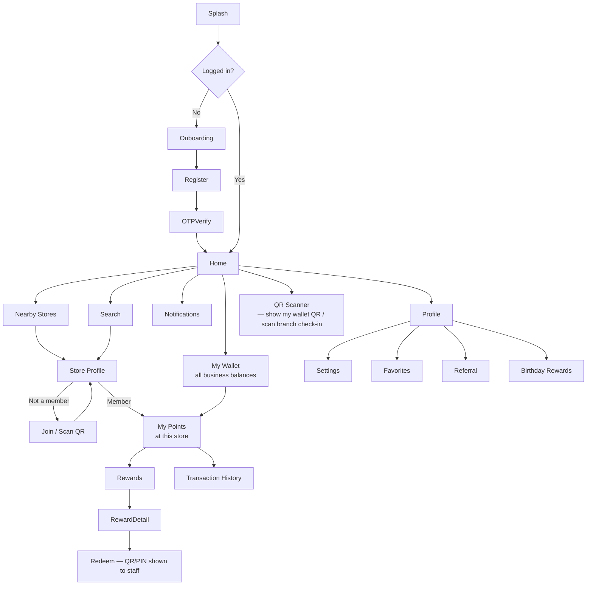
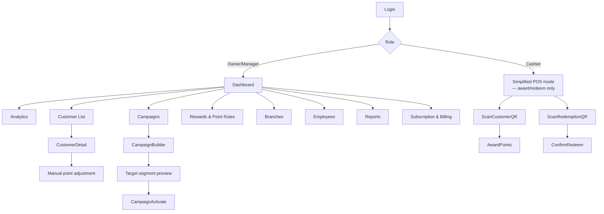
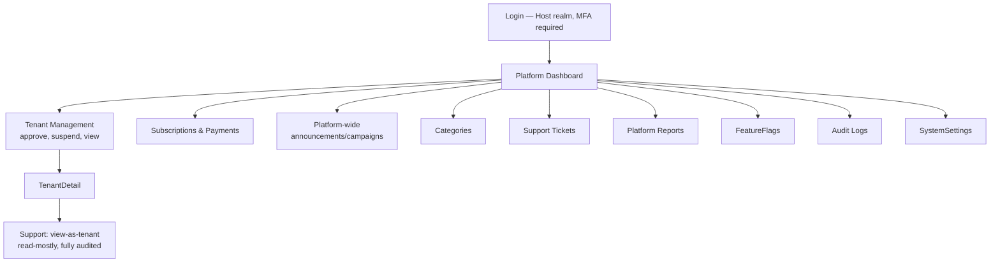

# 4. Product Experience

[← Back to index](README.md)

## Contents
- [Customer journey & navigation](#customer-journey--navigation)
- [Business (tenant staff) journey](#business-tenant-staff-journey)
- [Admin journey](#admin-journey)
- [5. Mobile app screen inventory](#5-mobile-app-screen-inventory)
- [19. UX guidelines](#19-ux-guidelines)

## Customer journey & navigation

**Navigation shape:** bottom tab bar with **Home, Search, Wallet, Notifications, Profile** — five
items max (a sixth tempts feature-creep into the tab bar itself). "Nearby Stores" lives inside Home,
not as its own tab, since it's a discovery surface a returning member visits less than their Wallet.

## Business (tenant staff) journey

**Deliberate split:** Cashier-role staff land in a **reduced POS-style mode**, not the full dashboard
— this is a permissions decision (see [role table](01-business-strategy.md#business-roles-tenant)),
but it's also a UX one: a cashier at checkout needs "scan and confirm" in two taps, not a dashboard
with campaigns and billing visible as distractions (and as attack surface if the device is shared).

## Admin journey

As established in [System Architecture](02-system-architecture.md#high-level-architecture), this is
the **same Angular application** as the business dashboard, not a separate build — a Host-realm admin
sees this navigation tree; a Tenant-realm business user sees the business journey above. One
codebase, permission-gated navigation, exactly how ABP's Angular app already separates Host vs Tenant
concerns by convention.

## 5. Mobile app screen inventory

| Screen | Purpose | Key elements | Navigates to |
|---|---|---|---|
| Splash | Brand + auth-state check while session/token is validated | Logo, loading indicator | Onboarding or Home |
| Onboarding | First-run value explanation (3 slides max) | "Join businesses," "Collect points," "Redeem rewards" | Register/Login |
| Register | Create the one global account | First/last name, DOB, gender, phone, optional email, password or OTP choice | OTP Verify |
| OTP Verify | Phone verification | 6-digit code input, resend timer | Home (first-time) |
| Login | Returning user | Phone/email + password, or "Login with OTP" | Home |
| Home | Discovery + quick access to active memberships | "My businesses" carousel (balance per business), nearby/featured stores, active offers | Store Profile, Nearby, Search |
| Nearby Stores | Location-based discovery | Map/list toggle, category filter, distance | Store Profile |
| Search | Find a business by name/category | Search bar, recent searches, category chips | Store Profile |
| Store Profile | Everything about one business | Logo/cover, category, branches, current offers, "Join" or points balance if already a member, Follow toggle | Join flow, My Points, Rewards |
| Join flow | Become a member of a business | Scan branch QR, or "Join" button from Store Profile; optional referral code entry | Store Profile (as member) |
| My Points | Points detail for **one** business | Balance, tier progress bar, "Earn more" hint, quick links to Rewards/History | Rewards, Transaction History |
| Wallet | Cross-business summary — the "John: Starbucks 450, Nike 120" screen | List of all memberships with balances, sorted by recent activity | My Points (per business) |
| Rewards | Redeemable catalog for one business | Grid of rewards with points cost, affordability indicator (greyed out if insufficient points) | Reward Detail |
| Reward Detail | One reward | Description, cost, terms, "Redeem" CTA | Redeem confirmation (QR/PIN) |
| Redeem Confirmation | Staff-facing proof of redemption | Large QR or PIN, countdown timer (short-lived token, [security note](02-system-architecture.md#security)) | Back to My Points on success |
| Transaction History | Ledger for one business | Chronological list: earned/redeemed/expired, filterable by type/date | — |
| Coupons | Active/past redeemed rewards | Status chips (Active/Used/Expired) | Reward Detail |
| Campaigns / Offers feed | What's currently running across joined + followed businesses | Cards per active campaign/offer, business logo, expiry | Store Profile |
| Notifications | Inbox of push/in-app messages | Grouped by business, unread indicator | Relevant screen per notification type |
| QR Scanner | Dual-purpose: show my wallet QR to staff, or scan a branch check-in QR | Camera view + "My QR code" toggle | My Points (after check-in) |
| Referral | Invite friends | Personal referral link/code, share sheet, referral status list | — |
| Birthday Rewards | Upcoming/available birthday perks across businesses | List of businesses offering a birthday reward this month | Reward Detail |
| Favorites | Followed businesses not yet joined, or bookmarked for later | List, matches the `Follow` entity from the [database design](03-database-design.md#engagement--gamification) | Store Profile |
| Profile | Account management | Name, DOB, gender, phone/email, avatar | Settings |
| Settings | Preferences | Notification channel toggles, language, dark mode, linked devices (log out per device), delete account | — |

## 19. UX guidelines

| Area | Recommendation | Why |
|---|---|---|
| Onboarding | 3 slides max, skip button always visible, no forced tutorial before first real action | Loyalty apps live or die on "time to first points balance visible" — don't gate that behind a tour |
| Empty states | Every list screen (Wallet, Rewards, Notifications, Favorites) needs a designed empty state with a clear next action ("Join your first business") | A new customer's Wallet screen is empty by default — this is the *first* screen many users see post-registration; a blank list reads as broken, not "not yet used" |
| Animations | Purposeful only: balance-increment animation on points earned, confetti/success state on redemption | Reinforce the "reward" feeling at the two moments that matter (earn, redeem); avoid decorative motion elsewhere that costs battery/performance for no retention benefit |
| Accessibility | Minimum tap target sizes, dynamic text scaling support, color contrast (especially for tier/balance colors — don't rely on color alone to distinguish tiers), screen-reader labels on the QR/wallet screen especially | The wallet/QR screen is the single most business-critical screen in the app — it must work for everyone |
| Dark mode | Supported from Phase 1, not retrofitted later | Cheaper to build with Flutter's theming from the start than to audit every screen for hardcoded colors after the fact |
| Performance | Wallet balance and store profile must load from cache instantly, then refresh — never a blocking spinner on the screen a customer opens most often | See [Flutter Architecture](05-flutter-architecture.md#offline--caching-strategy) for the caching approach |
| Localization / RTL | **Confirmed requirement** — target market is Arabic + English. Every screen ships bilingual and RTL-aware from Phase 1, not retrofitted later; both ABP's Angular theme (Lepton X) and Flutter support RTL natively | Retrofitting RTL into screens built LTR-only is expensive — this is now a Phase 1 baseline, not a later nice-to-have |
| QR/PIN redemption screen | Must work with **zero network latency perception** — pre-fetch the redemption token before the customer taps "Redeem" if possible, so the QR renders instantly in front of a staff member and a real-world queue | A slow-loading QR code at checkout is a directly observable, trust-eroding failure in exactly the moment the product is supposed to feel effortless |
