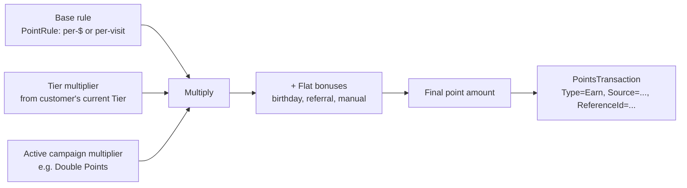
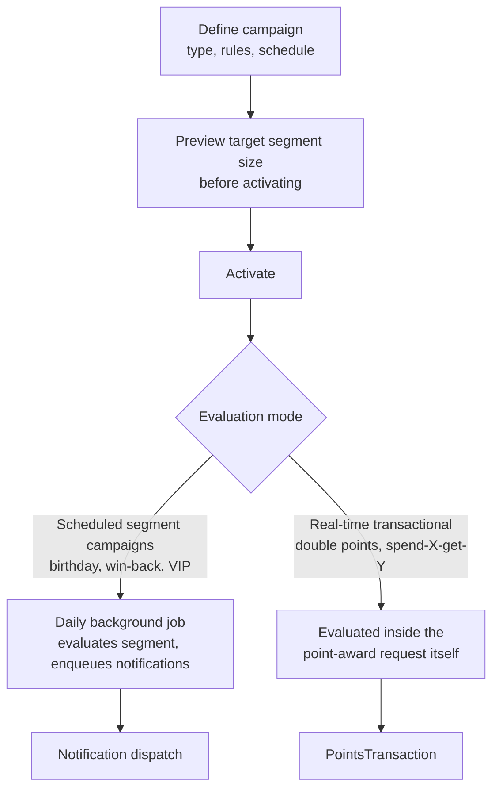

# 7. Loyalty Engine

[← Back to index](README.md)

## Contents
- [8. Points system](#8-points-system)
- [9. Rewards system](#9-rewards-system)
- [10. Campaigns](#10-campaigns)
- [11. Customer engagement](#11-customer-engagement)
- [Future features](#future-features)

## 8. Points system

**Design as a composable pipeline, not a flag list.** The brief enumerates a dozen point behaviors
(per-$, custom, double points, bonus, birthday, referral, tier multiplier, campaign multiplier,
expiration, negative points, refund, manual adjustment) — implementing each as its own special-cased
code path is how point-calculation logic becomes unmaintainable within two quarters of launch. Model
it instead as: **a base rule, multiplied by active modifiers, plus flat bonuses, producing one
`PointsTransaction`.**

**Worked example:** a customer at Gold tier (1.5× multiplier) makes a $40 purchase during a "Double
Points Weekend" campaign (2×), with a base rule of 1 point per $1: `40 base × 1.5 tier × 2 campaign =
120 points`, recorded as one `PointsTransaction` with `Source = Purchase` and a `ReferenceId` pointing
at the campaign for later attribution reporting ([Marketing reports](06-dashboards-admin.md#12-reports--analytics)).

| Behavior from the brief | How it maps onto the pipeline |
|---|---|
| 1 point per $ / custom earning | `PointRule.RuleType = PerCurrencyUnit`, `PointsPerUnit` configurable per tenant |
| Double points / campaign multiplier | An active `Campaign` of type `DoublePoints` contributes a multiplier for its duration |
| Bonus points, birthday bonus, referral bonus | Flat additions, each its own `PointsTransaction` with `Source = Birthday`/`Referral`/`Manual`, **not** folded into the multiplier stage — bonuses should be independently visible in the ledger and independently reportable |
| Tier multiplier | Read from the customer's `PointsWallet.CurrentTierId` at transaction time — **snapshot the multiplier value onto the transaction**, don't just reference the tier, so a later tier-definition change doesn't retroactively alter historical transaction meaning |
| Point expiration | Background job ([System Architecture](02-system-architecture.md#background-jobs)) inserts `Type = Expire` transactions for anything past `ExpiresAt` — expiration is itself a ledger entry, never a silent balance edit |
| Negative points / refund | `Type = Redeem` (points spent) is already negative-effect; a *refund of a purchase* that already earned points is `Type = Refund`, referencing the original `PointsTransaction.Id`, so "why did this customer's balance drop outside of a redemption" is always traceable |
| Manual adjustment | `Type = Adjust`, always carries `CreatedByEmployeeId` (never anonymous), and per the [risk table](01-business-strategy.md#21-risks) should be capped per-staff-per-day to limit fraud/error blast radius |

**Rounding policy:** decide once, document it, apply everywhere — e.g. round down (floor) fractional
points, since rounding up on every transaction is a slow, invisible margin leak across millions of
transactions. This is a two-line config decision that's genuinely easy to get wrong by never deciding
it explicitly and letting it default to whatever the first engineer's code happened to do.

## 9. Rewards system

| Redemption type | How it works | Notes |
|---|---|---|
| Discount | Coupon encodes a % or flat discount; staff applies manually at POS (Eksabli doesn't process the underlying payment) | Simplest to implement, most common in practice |
| Free product | Coupon names a specific item; staff fulfills manually | No inventory integration in MVP — that's a real project-management-system integration, out of scope until a specific customer needs it |
| Gift card | Coupon is a stored-value code | If gift cards carry real monetary value redeemable across visits, treat balance tracking with the same ledger discipline as points ([Database Design](03-database-design.md#membership--wallet)) — this is money, not a marketing artifact |
| QR redemption | Customer shows a QR (from `Reward Detail` → `Redeem Confirmation`), staff scans, server validates + burns the token | Preferred default — fastest at a real counter |
| PIN redemption | Customer shows a short numeric code instead of a QR | Fallback for low-connectivity or camera-less POS setups; same server-side validate-and-burn logic, different presentation |
| Approval workflow | High-value rewards (above a tenant-configured points threshold) require a Manager to confirm, not just any Cashier | Optional per-tenant setting on `Reward`, not a platform-wide rule — a $5 coffee reward and a $200 gift card shouldn't have the same approval bar |

Both QR and PIN redemption use the **same token-gated pattern already implemented in this repo** for
Excel downloads (`IDistributedCache<...TokenCacheItem>`, short TTL, single validate-then-burn use) —
see [Database Design → Rewards & redemption](03-database-design.md#rewards--redemption) for the exact
mapping. This isn't a coincidence worth re-deriving from scratch; it's the same problem shape
("give the bearer of this token exactly one privileged action, briefly") solved once.

## 10. Campaigns

**Campaign = type + targeting rule + schedule + effect.** Rather than describing each campaign type
in the brief as a separate feature, they decompose into the same engine with different parameters:

| Campaign type | Targeting | Effect |
|---|---|---|
| Birthday | `Membership`s with `CustomerProfile.DateOfBirth` in N days | Flat bonus points or a specific `Reward` grant |
| Black Friday / Happy Hour / Weekend | All active members, or branch-scoped | Multiplier (double points) or flat discount `Offer`, time-boxed |
| VIP customers | Segment: `CurrentTierId` = top tier(s) | Exclusive `Offer`/early access, or bonus multiplier |
| Inactive customers (win-back) | Segment: no `PointsTransaction` in N days | Bonus points or a compelling `Reward` nudge, **capped send frequency** so win-back doesn't become spam |
| Spend X Get Y | Rule evaluated at transaction time: single purchase ≥ X triggers bonus Y | Effect applied inline at the point-award pipeline stage, not a separate notification-only campaign |
| Double points | All active members or a segment | Multiplier stage in the [points pipeline](#8-points-system) |
| New customer | Segment: `Membership.JoinedAt` within N days | Welcome bonus, often paired with [referral](#11-customer-engagement) |
| Referral | Triggered on `Referral.Status = Completed` | Bonus to both referrer and referee |

**Targeting is two different evaluation modes, not one** — this is worth calling out because it's
easy to design a campaign engine as if every campaign is "notify a segment," when several of the
brief's own examples (double points, spend-X-get-Y) are actually **real-time rules evaluated inside
the checkout/point-award flow**, not batch jobs. Building only the batch-sweep model would leave
"Double Points Weekend" unable to actually double points at the register — it would just be able to
*talk about* doubling points. Both evaluation modes are required from Phase 3.

## 11. Customer engagement

| Mechanic | Fit | Recommendation |
|---|---|---|
| Push/Email/SMS | Universal, always relevant | Core notification infrastructure, [already designed](02-system-architecture.md#notification-service) |
| Referral | Universal, high ROI (CAC-efficient growth) | Phase 3 — see [MVP roadmap](01-business-strategy.md#20-mvp-roadmap) |
| Tiers/Levels | Fits any repeat-purchase business | Phase 4, already modeled in [database design](03-database-design.md#membership--wallet) |
| Achievements/Badges | Fits retail/F&B/entertainment well; feels out of place for e.g. a professional services business | Make optional per-tenant (a `Tenant`-level feature toggle via ABP Feature Management), not a forced platform-wide mechanic |
| Daily streaks / challenges | High engagement *for the right category* (coffee shops, gyms), can feel gimmicky or even irrelevant for others (a dentist's office loyalty program) | Same per-tenant opt-in treatment as badges — don't force it |
| Spin wheel / scratch cards | Strong short-term engagement, real risk of feeling "casino-like" if overused, and some jurisdictions regulate chance-based promotions attached to purchases | Treat as a Phase-4+/future feature, and get a legal read on gambling-adjacent regulations in target markets before building — this is a genuine legal risk, not just a product nice-to-have (see [Risks](01-business-strategy.md#21-risks)) |
| Gamification generally | Retention lever, not a core-loop requirement | Sequenced after the core loop and campaign engine are proven — matches the [MVP roadmap philosophy](01-business-strategy.md#20-mvp-roadmap) of not building retention tooling before there's something to retain users *in* |

**The critical point:** not every engagement mechanic fits every business category the platform will
onboard. Making badges/streaks/spin-wheel **tenant-level opt-in features** (a Feature Management flag,
reusing the same mechanism as plan entitlements) rather than platform-wide defaults avoids a dentist's
loyalty program looking like a mobile game, while still letting a café or gym's program lean into it
fully.

## Future features

Organized by proximity to the core loop, since "innovative" isn't the same question as "next" — see
the [MVP roadmap](01-business-strategy.md#20-mvp-roadmap) for what's already sequenced into Phases 1–4.

| Feature | Why it's deferred (not "why it's bad") |
|---|---|
| Apple Wallet / Google Wallet passes | Genuinely high-value (a wallet-native card is a strong retention hook) and technically well-understood — good **Phase 5** candidate once the core wallet/points model is stable, since a wallet pass is a read-only projection of data that already needs to exist first |
| Digital receipts | Natural extension of the points-award flow (attach a receipt to a `PointsTransaction`) — reasonable near-term addition once POS-side integration patterns exist |
| Location-based offers | Builds directly on the `Branch` geo fields and [PostGIS scalability note](02-system-architecture.md#scalability) — sequencing depends on discovery/search maturity, not on new data modeling |
| Personalized campaigns / customer segmentation (rules-based) | Already partially covered by [campaign targeting](#10-campaigns) — "personalized" here likely means *finer-grained* segments (RFM-style: recency/frequency/monetary), which is a segmentation-UI investment, not new infrastructure |
| AI recommendations / churn prediction | Needs real transaction volume and outcome data to be better than the [rule-based win-back campaigns](#10-campaigns) already in Phase 3 — building a model before there's data to train it on on produces a worse result than the simple rule, for real engineering cost |
| NFC / Beacon check-in | Solves a problem (frictionless check-in) that QR already solves adequately at MVP scale; worth revisiting if a specific retail-chain customer needs contactless check-in at high throughput |
| In-app chat (customer↔business) | New moderation, support, and abuse-prevention surface — real scope, not a small add-on; validate demand via [support tickets](06-dashboards-admin.md#7-admin-panel-host-realm) volume first |
| Marketplace (businesses selling directly in-app) | Materially different product (payments, fulfillment, disputes) — effectively a second product built on top of the loyalty platform, not a feature of it; treat as a separate business decision, not an engineering backlog item |
| Gift points / transfer points between customers | Real fraud-surface expansion (a new way to launder/move value) on top of the [points system](#8-points-system) — needs its own fraud-review pass before design, not just a UI screen |
| Family accounts | Interacts awkwardly with the [two-realm identity model](02-system-architecture.md#two-identity-realms-the-key-decision) (is a family a shared wallet, or linked individual wallets with visibility? — genuinely unresolved design question, not just unbuilt) |
| Subscriptions (customer-paid, e.g. "VIP membership" sold to end customers by a business) | A second billing relationship (business→customer) layered on top of the existing platform→business billing — real scope, sequence after the platform's own [billing](02-system-architecture.md#14-api-design) is proven |

None of these are "bad ideas" — they're ideas that are each easier and better-designed *after* the
core loop and the identity model have real usage data behind them, which is the same discipline the
[MVP roadmap](01-business-strategy.md#20-mvp-roadmap) applies throughout this design.
