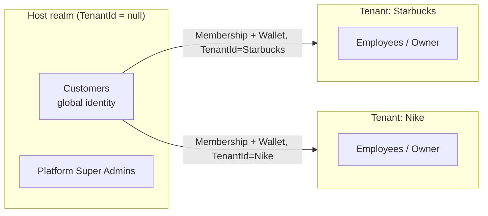

# Eksabli — Loyalty Platform: Product & Technical Design

**Status:** Pre-build analysis / architecture decision record
**Audience:** Founders, product, engineering (backend, Flutter, web), design

> **Naming note (resolved):** confirmed with the product owner — the name is **Eksabli**, matching
> this repository. The "Exply" line in the original brief's overview was a leftover from a template
> and isn't used anywhere in this design.
>
> **Target market (confirmed):** Arabic and English, bilingual. This is treated as a Phase 1 baseline
> throughout — not a "nice to have" localization pass — see [Product Experience](04-product-experience.md#19-ux-guidelines),
> [Flutter Architecture](05-flutter-architecture.md#localization), and the bilingual-content note in
> [Database Design](03-database-design.md#cross-cutting-notes).

## What this is

A ground-up business and technical analysis for Eksabli: a multi-tenant SaaS loyalty platform where
**businesses** run their own loyalty program and **customers** collect points across many businesses
from a single account. It is organized as eight linked documents rather than one monolithic file —
each is independently useful, and together they cover the 22 areas requested in the brief.

This analysis is **grounded in the actual repository**, not written in a vacuum: `Eksabli` already
exists as an ABP Framework 10.5 + Angular 21 solution (see the root [`CLAUDE.md`](../../CLAUDE.md)),
currently scaffolded with a "book store" tutorial domain (`Author`/`Book`). That scaffolding is
disposable, but the underlying platform choice (ABP on .NET, PostgreSQL, OpenIddict, Angular) is not
a blank slate — it already ships Identity, multi-tenancy, permission management, feature management,
background jobs, audit logging, and blob storage. A recurring theme in this design is: **use what's
already wired in before reaching for a new tool.**

## Document map

| # | Document | Covers (brief sections) |
|---|----------|--------------------------|
| 1 | [Business Strategy](01-business-strategy.md) | Roles, SaaS model, multi-tenancy strategy, revenue & pricing, customer/store lifecycle, MVP roadmap, risks, final CTO recommendations *(§1, 20, 21, 22)* |
| 2 | [System Architecture](02-system-architecture.md) | Architecture pattern, monolith-vs-microservices, auth, API gateway, background jobs, notifications, security, API design, scalability, backend technology *(§2, 13, 14, 15, 17)* |
| 3 | [Database Design](03-database-design.md) | Full entity catalog, ER diagrams, indexing notes *(§3)* |
| 4 | [Product Experience](04-product-experience.md) | Customer/business/admin journeys, mobile app screen inventory, UX guidelines *(§4, 5, 19)* |
| 5 | [Flutter Architecture](05-flutter-architecture.md) | Folder structure, state management, navigation, offline strategy, DI *(§16)* |
| 6 | [Dashboards & Admin](06-dashboards-admin.md) | Business (tenant) dashboard, platform admin panel, reporting/analytics *(§6, 7, 12)* |
| 7 | [Loyalty Engine](07-loyalty-engine.md) | Points strategies, rewards/redemption, campaign engine, engagement/gamification, future features *(§8, 9, 10, 11, 18)* |

## The one decision everything else depends on

Before any of the documents below make sense, one architectural fork needs to be named explicitly,
because the brief's business model creates a tension that generic ABP tutorials don't cover:

> *"Customers install Exply once and can join unlimited businesses... each balance is completely independent."*

This means **Customers are platform-global identities**, but **Businesses are tenants** in the
standard ABP multi-tenant sense (isolated staff, branding, subscription, permissions). A customer
is never "inside" one tenant — they move across many. That's the opposite of how most ABP
multi-tenant apps are built (where every user, staff or end-customer, belongs to exactly one tenant).

The recommended resolution — detailed in [System Architecture §"Two Identity Realms"](02-system-architecture.md#two-identity-realms-the-key-decision) —
is to run **two identity realms on top of the single ABP Identity module already in this repo**:

Customers and platform admins live in the **Host** side of ABP's existing Host/Tenant split (already
present in `EksabliDomainModule` via `AbpTenantManagementDomainModule`). Businesses are **Tenants**.
A `Membership` + `PointsWallet` pair (both carrying `TenantId` and implementing `IMultiTenant`) is the
bridge — it's what makes "450 points at Starbucks, 120 at Nike" both independent *and* queryable
per-business with ABP's automatic tenant filtering, while still being listable cross-tenant for the
customer's own wallet screen (via `DataFilter.Disable<IMultiTenant>()`, filtered by `CustomerId`
instead — a pattern already documented in this repo's `.cursor/rules`).

Everything else in this design — the database schema, the Flutter auth flow, the OpenIddict token
strategy, and the scalability plan — follows from this one call. Read that section before the rest.

## How to read this if you only have 10 minutes

1. This page's "one decision" box above.
2. [Business Strategy → Final CTO Recommendations](01-business-strategy.md#22-final-recommendations) — what to build, what to cut, what to challenge.
3. [System Architecture → high-level diagram](02-system-architecture.md#high-level-architecture).
4. [Business Strategy → MVP Roadmap](01-business-strategy.md#20-mvp-roadmap).
