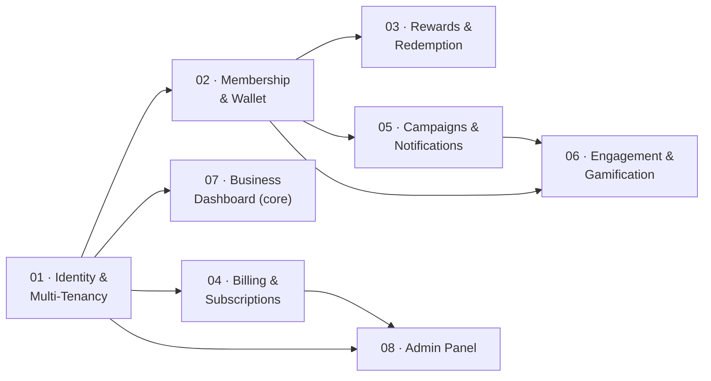

# Eksabli — Feature Breakdown for Implementation

[← Back to platform docs index](../README.md)

The seven documents in the parent folder are organized by **concern** (business strategy,
architecture, database, product experience, Flutter, dashboards, loyalty engine) — good for
understanding the platform as a whole, but nobody implements a "concern." This folder reorganizes
the same decisions into **vertical feature slices**: each folder below is self-contained enough to
hand to a developer and start building — domain model, API surface, business rules, screens
(Flutter + Angular), permissions, and a concrete build checklist, all in one place, with pointers
back to the source docs for the full reasoning behind each decision rather than repeating it.

## Build order

Numbering reflects dependency order, not necessarily calendar order — it matches the
[MVP roadmap](../01-business-strategy.md#20-mvp-roadmap) phases:

| # | Feature | MVP Phase | Depends on |
|---|---------|-----------|------------|
| [01](01-identity-multi-tenancy/README.md) | Identity & Multi-Tenancy | Phase 1 | — (foundational) |
| [02](02-membership-wallet/README.md) | Membership & Wallet | Phase 1–2 | 01 |
| [03](03-rewards-redemption/README.md) | Rewards & Redemption | Phase 2 | 02 |
| [04](04-billing-subscriptions/README.md) | Billing & Subscriptions | Phase 2 | 01 |
| [05](05-campaigns-notifications/README.md) | Campaigns & Notifications | Phase 3 | 02 |
| [06](06-engagement-gamification/README.md) | Engagement & Gamification | Phase 3–4 | 02, 05 |
| [07](07-business-dashboard/README.md) | Business Dashboard (core) | Phase 1, 4 | 01 (+ each feature it surfaces) |
| [08](08-admin-panel/README.md) | Admin Panel | Phase 4 | 01, 04 |

**01 is not optional groundwork — it's the load-bearing decision.** Every other feature's
`Membership`/tenant-scoped entities assume the Host-realm-customer / Tenant-realm-business split
from 01 is correct. Build and prove it (see its README's implementation checklist) before starting
02.

## What's in each feature folder

Every `README.md` follows the same shape, so you can jump into any feature without re-learning the
structure:

1. **Overview** — what it does, why, which MVP phase, what it depends on
2. **Domain model** — the entities this feature owns (subset of [Database Design](../03-database-design.md))
3. **Business rules** — the non-obvious logic specific to this feature
4. **API surface** — endpoint groups (subset of [System Architecture §14](../02-system-architecture.md#14-api-design))
5. **Screens** — Flutter + Angular UI this feature needs (subset of [Product Experience](../04-product-experience.md) / [Dashboards & Admin](../06-dashboards-admin.md)), with links to the working mockup artifact where one exists
6. **Permissions** — the permission constants this feature introduces
7. **Implementation checklist** — this feature's entities run through the standard ABP new-feature flow already documented in `.cursor/rules/framework/common/development-flow.mdc`
8. **Open questions** — anything specific to this feature that's still unresolved

## Source-of-truth note

These feature docs summarize and re-slice decisions made in the parent-folder documents — they
don't re-litigate them. If a feature doc and a parent doc ever disagree, the parent doc's reasoning
is authoritative; update the feature doc to match rather than the reverse.
